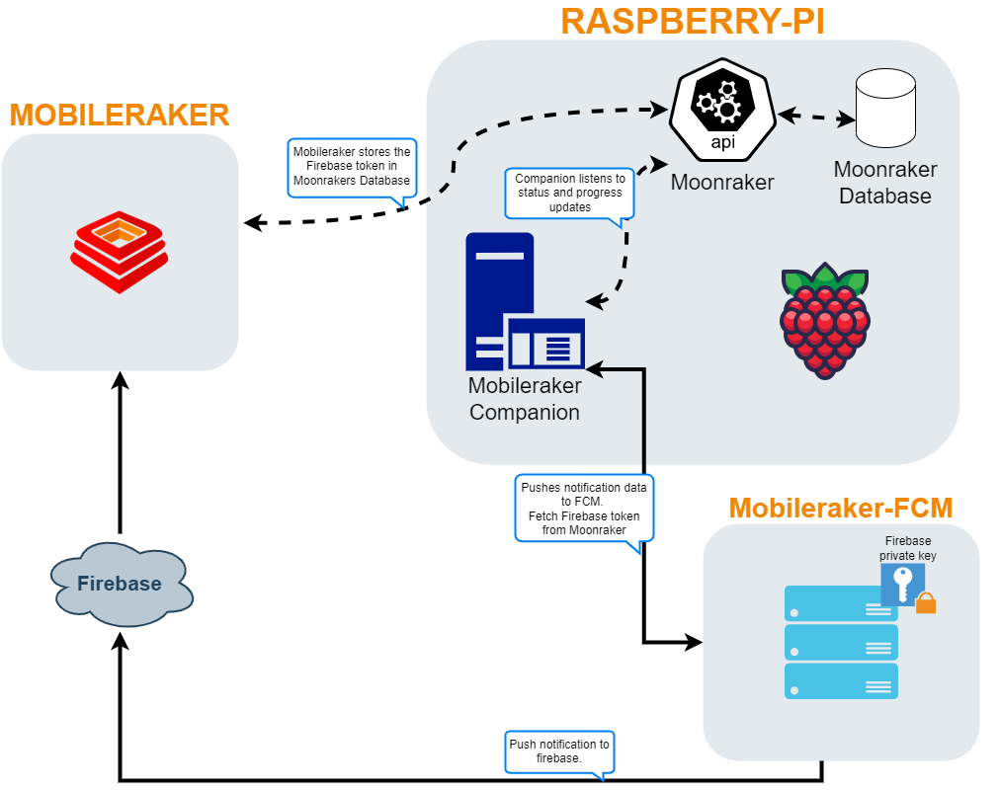

# mobileraker_companion


Companion for [Mobileraker](https://github.com/Clon1998/mobileraker), enabling push notification for [Klipper](https://github.com/Klipper3d/klipper) using [Moonraker](https://github.com/arksine/moonraker).

# Table of Contents
- [mobileraker\_companion](#mobileraker_companion)
- [Table of Contents](#table-of-contents)
- [Supported Platforms](#supported-platforms)
    - [Tested Platforms](#tested-platforms)
    - [Experimental Platforms](#experimental-platforms)
  - [Companion - Prerequisites](#companion---prerequisites)
    - [Installation Requirements](#installation-requirements)
    - [Python Compatibility](#python-compatibility)
    - [Python Package Dependencies](#python-package-dependencies)
- [Companion - Installation](#companion---installation)
  - [Using the Installer](#using-the-installer)
  - [Installation via Kiauh](#installation-via-kiauh)
  - [Run the Companion in Docker](#run-the-companion-in-docker)
  - [Standalone Installation](#standalone-installation)
    - [Key Benefits](#key-benefits)
    - [Installation Requirements](#installation-requirements-1)
    - [Quick Installation Steps](#quick-installation-steps)
  - [Manual Installation](#manual-installation)
- [Companion - Multi-Printer](#companion---multi-printer)
- [Companion - Config](#companion---config)
- [Moonraker - Update manager](#moonraker---update-manager)
- [Custom Notifications](#custom-notifications)
- [Uninstall](#uninstall)
- [How It Works](#how-it-works)
  - [Visualization of the Architecture](#visualization-of-the-architecture)
- [Changelog](#changelog)
  - [\[v0.4.0\] - 2023-08-26](#v040---2023-08-26)
  - [\[v0.3.0\] - 2023-03-29](#v030---2023-03-29)
  - [\[v0.2.1\] - 2022-07-07](#v021---2022-07-07)

# Supported Platforms

Mobileraker Companion was initially designed for use on a clean Klipper and Moonraker installation on Debian. Over time, it has evolved to extend support beyond Debian, enabling installation on various platforms, including those commonly used in Creality products.

### Tested Platforms

The companion has undergone successful testing on the following platforms:

- **Debian:** The companion is fully compatible with a clean Klipper and Moonraker installation on Debian systems like FluiddOS or MainsailOS. 

- **Creality Printers:** The companion has been specifically tested and validated on Creality's K1 series of printers and Sonic Pads.

### Experimental Platforms

Given that the companion is implemented as a Python script, there is potential for it to function on other platforms as well. However, it's important to note the following considerations:

- **Manual Installation:** On non-Debian platforms, manual installation of the service and configuration is required. The automatic installer script may not work in these cases.

> [!WARNING]
> While the companion has shown success on tested platforms, its behavior on other systems may vary. Community contributions and feedback on different platforms are encouraged.


## Companion - Prerequisites

The Mobileraker Companion is a standalone Python application designed to seamlessly connect with the Moonraker instance on your 3D printer. While it can be installed on any local network device, it is frequently installed directly on the printer itself for optimal integration.

### Installation Requirements

- **SSH/Console Access:** Ensure that you have SSH or console access to your 3D printer. This is necessary for both installation and configuration processes.

- **Root/Sudo Permissions:** The installation process requires root or sudo permissions to set up and configure the Companion successfully.

### Python Compatibility

The Companion was developed for Python 3.x. Please ensure that your system supports Python 3.x.

### Python Package Dependencies

> [!TIP]
> You can ignore this info if you are not planning on installing the companion manually. The installer, docker and kiauh will take care of that.

The required Python packages for the Companion are listed in the [mobileraker-requirements.txt](scripts/mobileraker-requirements.txt) file.

# Companion - Installation

Choose from several installation options for the Mobileraker Companion.

## Using the Installer
The installer provides the most convenient method for installing Mobileraker, particularly suited for a seamless experience for most users. However, we recommend exploring the alternative installation methods based on your preferences and system requirements.

To utilize the installer, open your terminal and execute the following commands:

```bash
cd ~/
git clone https://github.com/Clon1998/mobileraker_companion.git
./mobileraker_companion/scripts/install.sh
```

## Installation via Kiauh

Utilize the [Klipper Installation And Update Helper (Kiauh)](https://github.com/dw-0/kiauh) by dw-0 for an alternative installation method. Refer to the [Kiauh documentation](https://github.com/dw-0/kiauh/blob/master/README.md) for detailed instructions.


## Run the Companion in Docker
Run the Companion in a Docker container by creating a `mobileraker.conf` file and using the following commands:

```
docker run -d \
    --name mobileraker_companion \
    -v /path/to/mobileraker.conf:/opt/printer_data/config/mobileraker.conf \
    ghcr.io/clon1998/mobileraker_companion:latest
```

or via `docker compose`:
```yaml
services:
  mobileraker_companion:
    image: ghcr.io/clon1998/mobileraker_companion:latest
    volumes:
    - /path/to/mobileraker.conf:/opt/printer_data/config/mobileraker.conf
```
> [!WARNING]
> Adjust the paths in the volume mounts to point to your `mobileraker.conf` file.

## Standalone Installation

Mobileraker Companion offers a flexible standalone installation option for Debian-based systems, ideal for deploying on separate hardware with limited resources. This mode allows you to run the companion on a machine independent of your 3D printer's primary system.

### Key Benefits
- **Independent Deployment**: Run on a separate device from your 3D printer
- **Resource Efficiency**: Suitable for systems with minimal computing resources
- **Flexible Monitoring**: Simplified setup for distributed monitoring

### Installation Requirements
- Debian-based Linux distribution
- Git
- Basic command-line familiarity

### Quick Installation Steps

1. Open your terminal
2. Navigate to your home directory
3. Clone the Mobileraker Companion repository
4. Run the standalone installer

```bash
cd ~/
git clone https://github.com/Clon1998/mobileraker_companion.git
./mobileraker_companion/scripts/install.sh -standalone
```

## Manual Installation

For a manual installation, follow these steps:

1. Ensure Python 3.x is installed on your system.

2. Install the Python dependencies listed in [mobileraker-requirements.txt](scripts/mobileraker-requirements.txt).

3. Set up a Python virtual environment.

4. Create a `mobileraker.conf` file.

5. Run the companion script manually with the following options:

   - `-l`: Define the log location (folder or absolute path).
   
   - `-c`: Define the config location (absolute path).

Adjust the installation method based on your preferences and system requirements.

# Companion - Multi-Printer

The Mobileraker Companion is designed to support multiple printers. If you are using a single host for multiple Klipper and Moonraker instances, you can run the installation script described in [Using the Installer](#using-the-installer) multiple times. The script will intelligently handle the update of the `mobileraker.conf` file.

Alternatively, you can manually edit the `mobileraker.conf` file to add a new `[printer <Name>]` section for each printer. Refer to the following section for detailed information about the configuration format.

# Companion - Config
By default, you don't need to create a config file. However, if you want to use multiple printers with a single Companion instance, enforce logins via Moonraker, or modify the notification behavior, you can customize the configuration. Below is an overview of the available sections and configurations

```properties
[general]
language: en 
# !!! DEPRECATED. The app now syncs the app's language to the companion
# one of the supported languages defined in i18n.py#languages (de,en,...)
# !!! For users from the UK: entering 'uk' will resolve to Ukrainian language, not English. Use 'en' for English!
# Default: en
timezone: Europe/Berlin 
# correct timezone e.g. Europe/Berlin for Berlin time or US/Central. 
# For more values see https://gist.github.com/heyalexej/8bf688fd67d7199be4a1682b3eec7568
# Default: Tries to use system timezone
# Optional
eta_format: %%d.%%m.%%Y, %%H:%%M:%%S
# Format used for eta and adaptive_eta placeholder variables
# For available options see https://strftime.org/
# Note that you will have to escape the % char by using a 2nd one e.g.: %d/%m/%Y -> %%d/%%m/%%Y
# Default: %%d.%%m.%%Y, %%H:%%M:%%S
# Optional
include_snapshot: True
# !! SUPPORTER ONLY - This feature requires beeing a supporter of Mobileraker as of now!
# Include a snapshot of the webcam in any print status/progress update notifications
# Default: True
# Optional


# Add a [printer ...] section for every printer you want to add
[printer <NAME OF YOUR PRINTER: optional>]
moonraker_uri: ws://127.0.0.1:7125/websocket
# Define the uri to the moonraker instance.
# Default value: ws://127.0.0.1:7125/websocket
# Optional
moonraker_api_key: False
# Moonraker API key if force_logins or trusted clients is active!
# Default value: False
# Optional
snapshot_uri: http://127.0.0.1/webcam/?action=snapshot
# !! SUPPORTER ONLY - This feature requires beeing a supporter of Mobileraker as of now!
# The ABSOLUT url to the webcam, the companion should make a screenshot of. 
# Default: 
# Optional
snapshot_rotation: 0
# The rotation applied to the image. Valid values : 0, 90, 180, 270
# Default: 0
# Optional
ignore_filament_sensors:
# Comma separated list of filament sensors to ignore, ignored filament sensors do not trigger 
# a notification if they are triggered. This is useful if you have a filament sensor that is used
# in a MMU setup like ERCF.
# IMPORTANT, do not include the sensor type. E.g. if your sensor is configured
# like: [filament_switch_sensor printhead_sensor] add `printhead_sensor` to the list.
# Default: empty
# Optional

```
> [!IMPORTANT]
> Please note that the configuration entry for the printer's Moonraker endpoint is `moonraker_uri`, not `moonraker_url`. It's a common mistake to confuse these two. Ensure you're using the correct key in your configuration.


The Companion searches for a `Mobileraker.conf` file in the following locations (in order of precedence):
1. `~/Mobileraker.conf`
2. `<mobileraker_companion DIR>/mobileraker.conf`
3. `~/printer_data/config/mobileraker.conf`
4. `~/klipper_config/mobileraker.conf`


A single Companion instance can support multiple printers. To configure multiple printers, add more `[printer ...]` sections to your config. Here's an example of a multi-printer config:
Example multi-printer config: 
```properties
[printer V2.1111]
moonraker_uri: ws://127.0.0.1:7125/websocket
# Define the uri to the moonraker instance.
# Default value: ws://127.0.0.1:7125/websocket
moonraker_api_key: False
# Moonraker API key if force_logins or trusted clients is active!

[printer Ratty]
moonraker_uri: ws://ratrig.home:7125/websocket
# Define the uri to the moonraker instance.
# Default value: ws://127.0.0.1:7125/websocket
moonraker_api_key: False
# Moonraker API key if force_logins is active!
ignore_filament_sensors: printhead_sensor, sensor_name2
```

> [!NOTE]
>   Please restart the system service to ensure the new config values are used. 
> You can do this by running the following terminal command:  
> ```bash
> sudo systemctl restart mobileraker.service
> ```


# Moonraker - Update manager
In order to get moonrakers update manager working with the companion add the following section to your `moonraker.conf`. 
```
[update_manager mobileraker]
type: git_repo
path: ~/mobileraker_companion
origin: https://github.com/Clon1998/mobileraker_companion.git
primary_branch:main
managed_services: mobileraker
virtualenv: ~/mobileraker-env
requirements: scripts/mobileraker-requirements.txt
install_script: scripts/install.sh
```
> [!IMPORTANT]
> This section is applicable to a default Klipper installation. If you're using a K1 or SonicPad, you may need to modify the `virtualenv` path accordingly.

# Custom Notifications

Unlock the full potential of Mobileraker Companion with personalized notifications tailored to your needs.

To add custom notifications, refer to the comprehensive documentation available in [Custom Notification](docs/Custom_Notifications.md). This guide provides detailed information, guiding you through the process of creating and optimizing custom notifications to suit your preferences and workflow.


# Uninstall
To uninstall the companion, please run the following command:

```bash
cd ~/mobileraker_companion
./scripts/install.sh -uninstall
```

# How It Works

Mobileraker Companion seamlessly connects to your 3D printer(s) and actively listens to the WebSocket for updates. Whenever the print status changes or a new M117 message is received, the companion triggers the process of constructing a new notification.

The workflow unfolds as follows:

1. **Notification Configuration Retrieval:**
   The companion retrieves the notification configuration for all registered devices from Moonraker's database. Your device is automatically registered by the Mobileraker Android/IOS app, syncing the notification configs to your printer.

2. **Notification Construction:**
   Based on the fetched notification configurations, the companion constructs the notification's title and content, ensuring relevance and accuracy.

3. **Notification Submission:**
   The constructed notification is then submitted to the FCM (Firebase Cloud Messaging) Backend to be relayed to Apple's/Google's Push services for delivery.

## Visualization of the Architecture



This visual representation illustrates the intricate architecture, showcasing how Mobileraker Companion orchestrates notifications in conjunction with your 3D printer.


# Changelog

## [v0.4.0] - 2023-08-26

- Restructured the project to make it easier to maintain and extend
- Improved the accuracy for the remaining_time, progress and eta
- Renamed the notification placeholder `remaining` -> `remaining_avg`
- Added new custom notification placeholders: `remaining_file, remaining_filament, remaining_slicer, cur_layer, max_layer`
- Added the ability to use custom_notifcations via a custom macro. See [Custom Notification](docs/Custom_Notifications.md#using-the-mr_notify-custom-macro) documentation.

## [v0.3.0] - 2023-03-29

- Added support for the new notification architecture of mobileraker v2.1.0
- Added support for custom `M117` notifications see [Custom Notification](docs/Custom_Notifications.md) documentation
- Moved logs to klipper's printer_dir/logs

## [v0.2.1] - 2022-07-07

- Added support for multiple printers using a single companion instance
- Added support for trusted clients using the API key of moonraker
